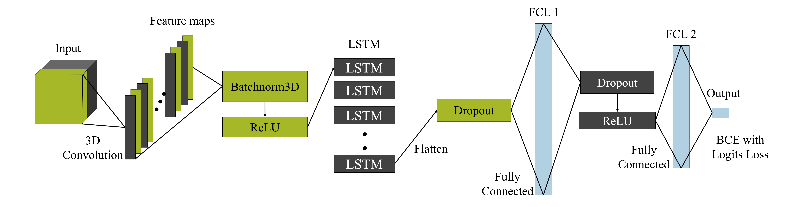
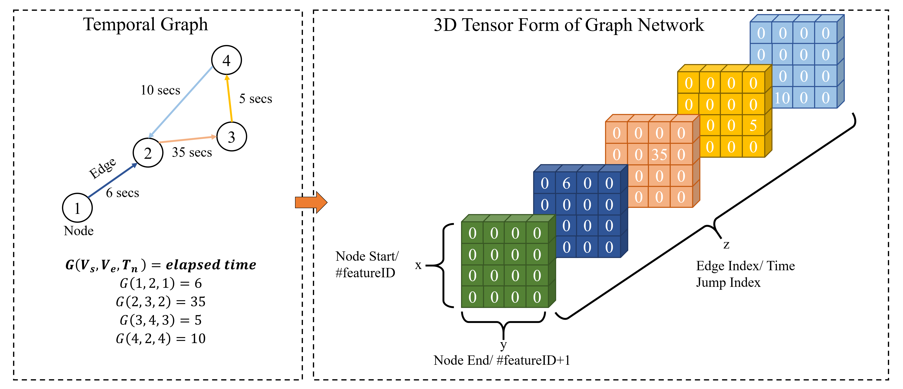

# TG-CNNs-for-Online-Course-Dropout-Prediction - IJACI ECAI 22

## What is in this repository?

This repository contains all the code used to obtain the results in the paper "TG-CNNs-for-Online-Course-Dropout-Prediction".


Architecture of the unbranched TG-CNN model used in this code:



## How do I run these scripts?

You can run these models by installing the requirements 

```
pip install requirements.txt
```
and following the steps below...

The `dataframe_save.ipynb` file converts the `mooc_actions.tsv` MOOC data file into a dataframe `.pkl` file (either containg the last 100 actions, or all 505 actions) with columns user ID, action ID and the time between the actions. The `labels_save.ipynb` file converts the final dropout label from `mooc_action_labels.tsv` into the `labels.npy` file for easier input when training the model.

To train and test the proposed unbranched TG-CNN model (with &gamma;=1) run

```
python models/mooc.py
```

To train and test the proposed unbranched TG-CNN model (with a variable &gamma; parameter) run

```
python models/mooc_with_gamma.py
```

To train and test the proposed branched TG-CNN model (with &gamma;=1) run

```
python models/branch_mooc.py
```

To train and test the proposed branched TG-CNN model (with a variable &gamma; parameter) run

```
python models/branch_mooc_with_gamma.py
```


The TG-CNN models could not be cross-validated due to the computation requirements exceeding the time limit of the high performance computer used in this project. Future work will involve validation of this model in a more robust manner.

To train the baseline LSTM model with 5-fold cross-validation run

```
python models/baseline_LSTM.py
```

To train the baseline RNN model with 5-fold cross-validation run

```
python models/baseline_RNN.py
```

Torch version 1.7.0, tensorflow 2.4.1, numpy 1.19.2, pandas 1.2.4, scikit-learn 0.23.1 and cuda 10.2.89 were used for creating these algorithms (as given in the `requirements.txt` file). This work made use of the facilities of the N8 Centre of Excellence in Computationally Intensive Research (N8 CIR) provided and funded by the N8 research partnership and EPSRC (Grant No. EP/T022167/1). The Centre is co-ordinated by the Universities of Durham, Manchester and York. A V100 GPU was used with an IBM POWER9 processor.

## Graph Network and Model Architecture Visualisation 

Graph network of actions and the elapsed time between them put into a 3D tensor form example:




## Useful Links to the Original Dataset and Corresponding Papers
* [Kumar et al's JODIE model](https://snap.stanford.edu/jodie/)
* [ACT MOOC Dataset](https://snap.stanford.edu/data/act-mooc.html)
